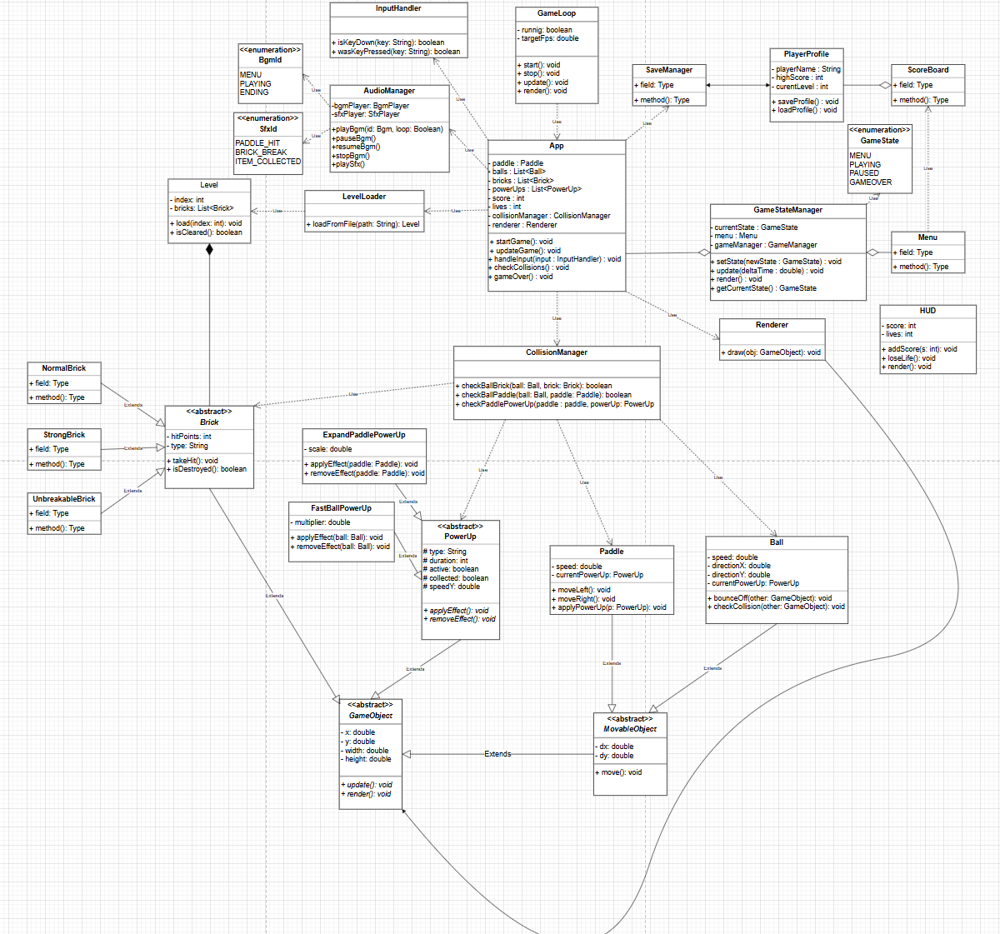
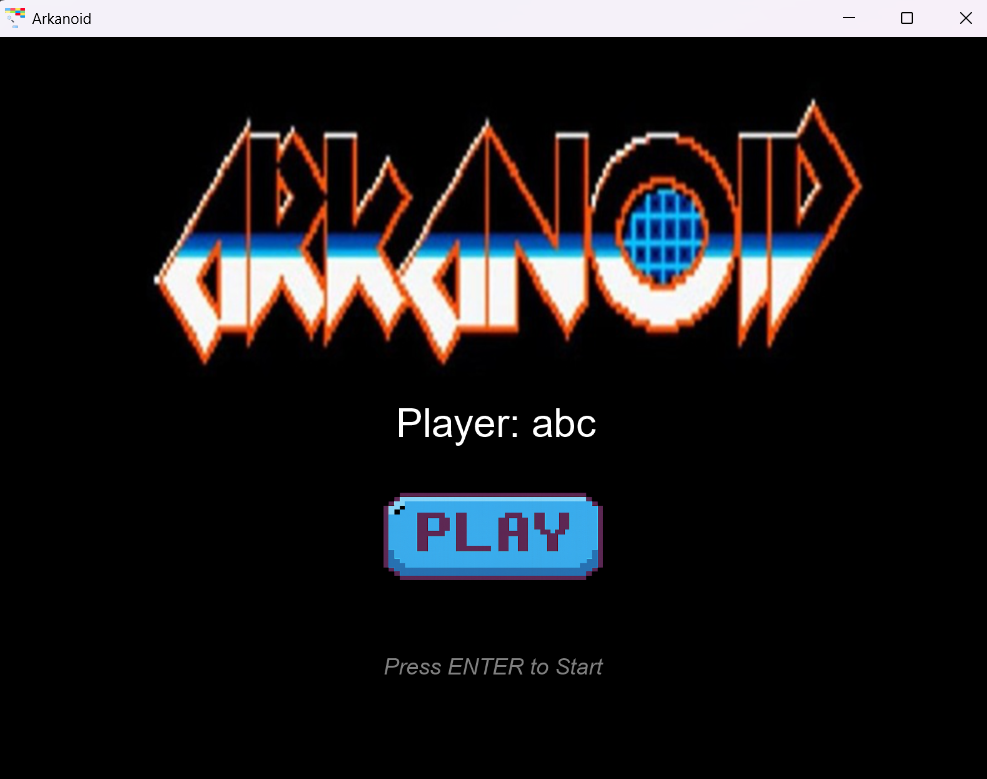
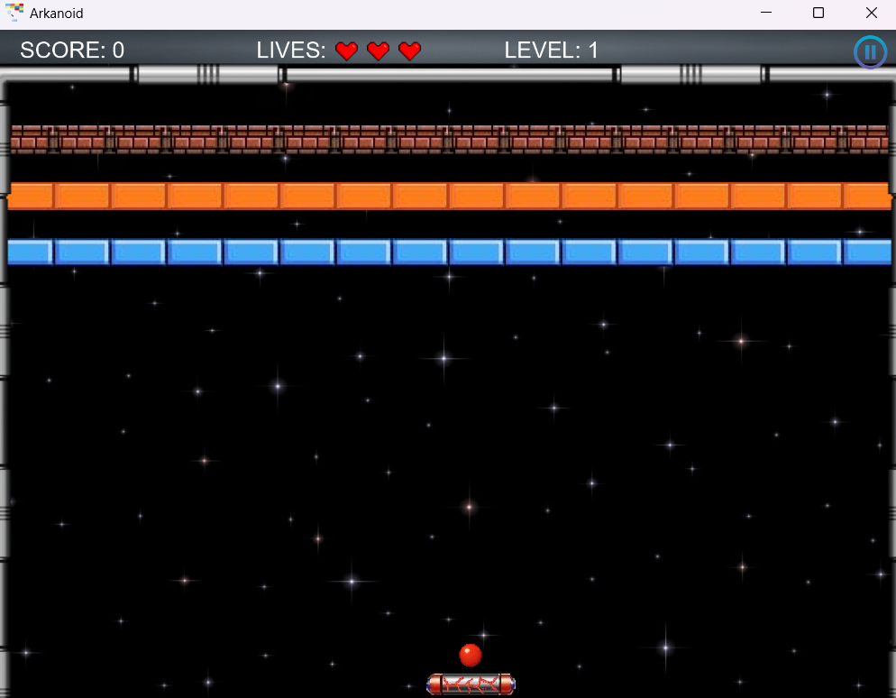
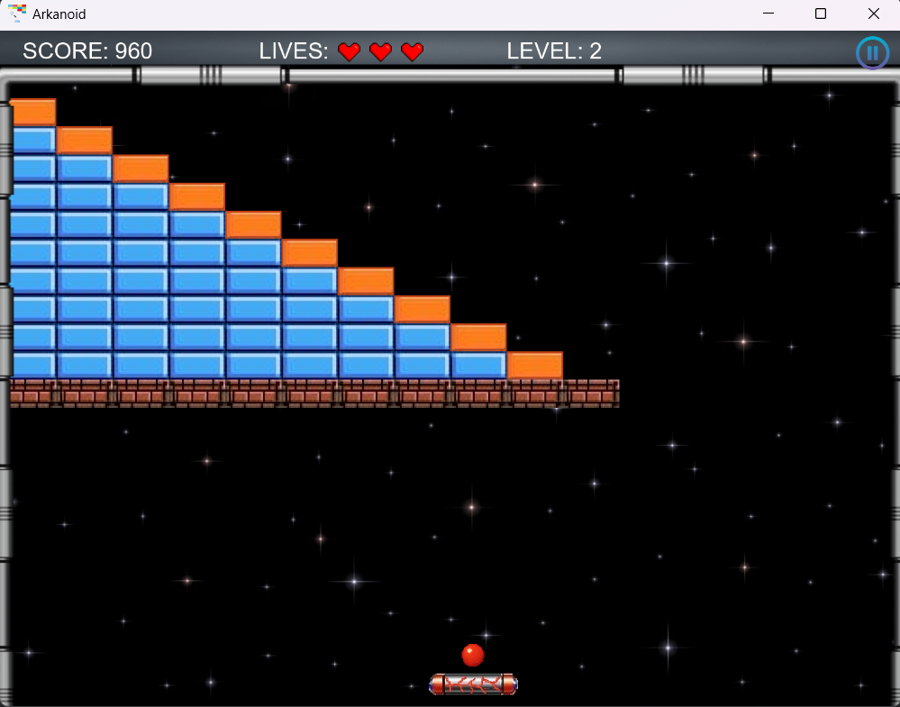
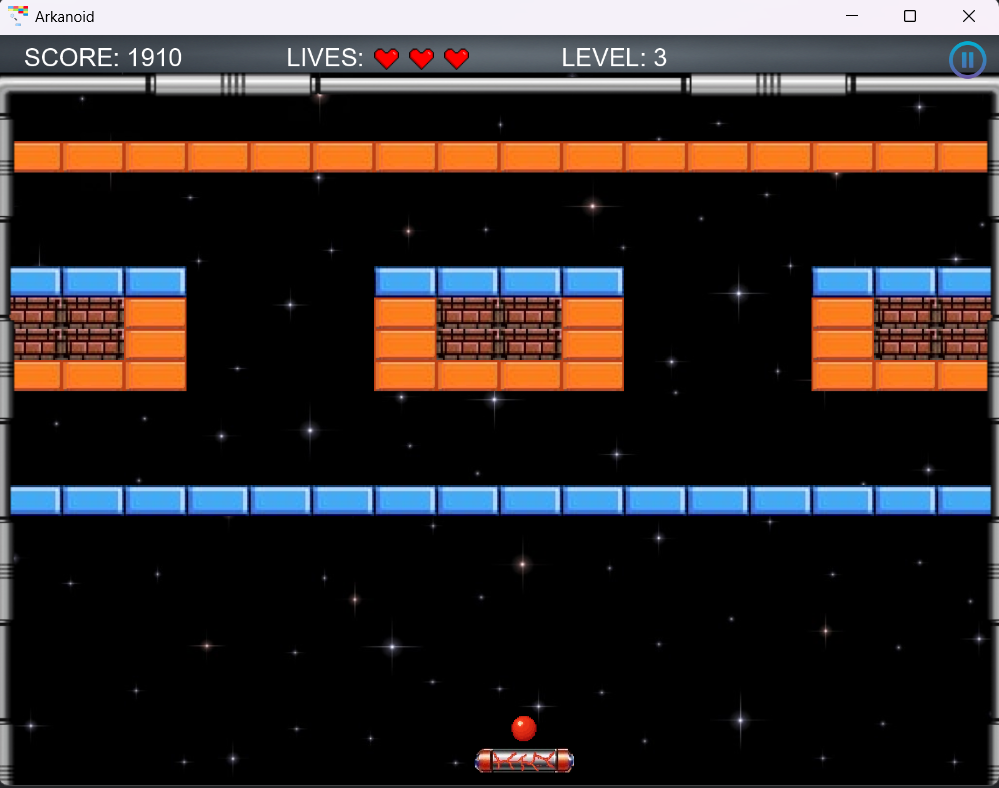
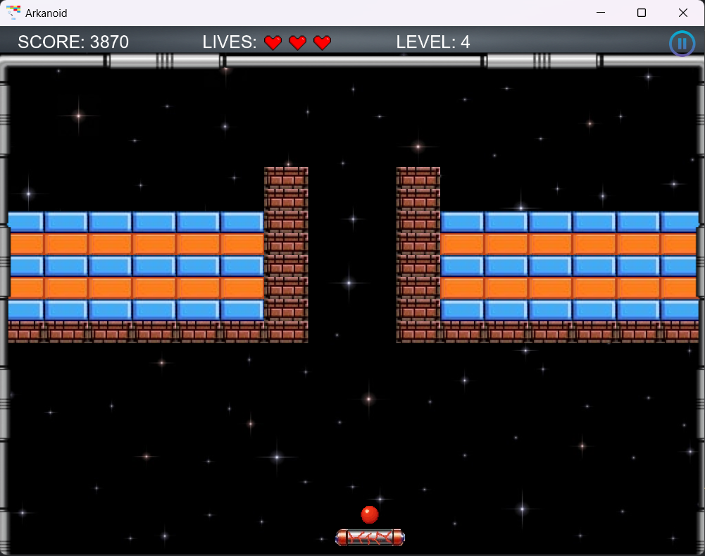
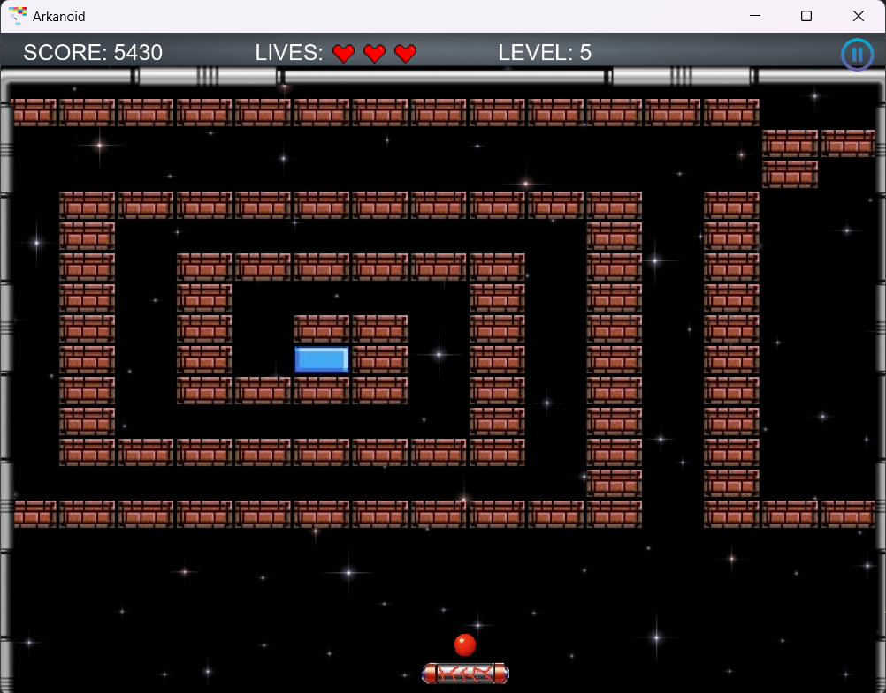
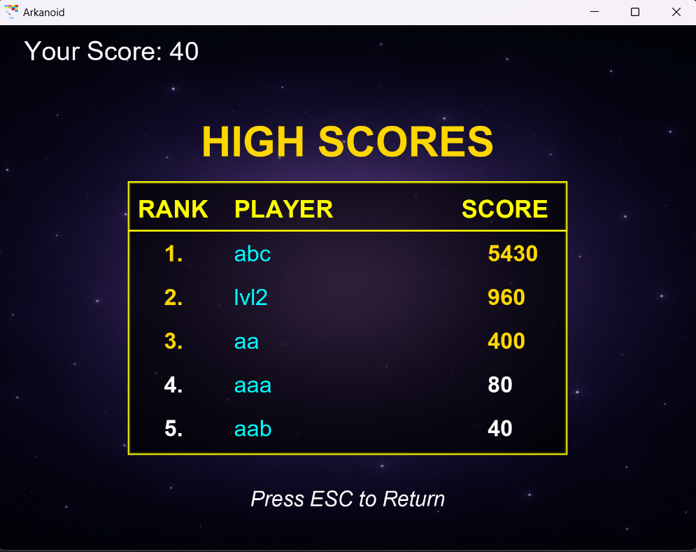

# 🎮 Arkanoid – Java OOP Game
**Arkanoid** là trò chơi phá gạch cổ điển được phát triển bằng **JavaFX** và các kiến thức về **lập trình hướng đối tượng (OOP)**.  
Dự án được thực hiện nhằm rèn luyện kỹ năng:
- Thiết kế phần mềm theo mô hình hướng đối tượng
- Làm việc nhóm với Git & GitHub
- Sử dụng UML Class Diagram để phân tích & thiết kế hệ thống
- Xây dựng giao diện đồ họa bằng JavaFX

---

## 🧩 Sơ đồ lớp UML

📄 *Sơ đồ thể hiện mối quan hệ kế thừa, tương tác và phụ thuộc giữa các lớp chính:*

---
## ⚙️ Tính năng chính
- Di chuyển paddle bằng bàn phím
- Va chạm vật lý chính xác
- Phá gạch, cộng điểm
- Power-up ngẫu nhiên (mở rộng paddle, tăng tốc bóng)
- Âm thanh nền và hiệu ứng va chạm
- HUD hiển thị điểm và mạng
- Menu chính và màn hình Game Over
- Lưu tiến trình người chơi

---

## 🖼️ Minh họa giao diện

### Màn hình Menu

### 🧱 Các màn chơi (Levels)
Người chơi cần **phá hết toàn bộ gạch** để hoàn thành level và tự động chuyển sang màn tiếp theo.

#### 🔹 Level 1

#### 🔹 Level 2

#### 🔹 Level 3

#### 🔹 Level 4

#### 🔹 Level 5

### 🧾 GameOver
Hiển thị danh sách **5 người chơi có điểm cao nhất** đã được lưu.

---

## 💫 Hệ thống Power-Up

Khi người chơi **phá một viên gạch**, trò chơi sẽ có **xác suất ngẫu nhiên** sinh ra một vật phẩm Power-Up.  
Power-Up sẽ **rơi xuống từ vị trí viên gạch vỡ**, và **nếu paddle hứng được** thì hiệu ứng tương ứng sẽ được kích hoạt.  
Mỗi loại Power-Up được cài đặt dưới dạng **lớp kế thừa từ `PowerUp`**, với hành vi được định nghĩa lại trong phương thức `applyEffect()`.

---

### ⚙️ Cơ chế hoạt động

1. Gạch bị phá → tạo Power-Up ngẫu nhiên.
2. Power-Up rơi dọc theo trục y (giống vật thể vật lý).
3. Khi va chạm với paddle → gọi `applyEffect()` để áp dụng hiệu ứng.
4. Nếu rơi ra ngoài màn hình thì biến mất (không kích hoạt).
5. Một số Power-Up có thời gian hiệu lực nhất định, hiển thị trên HUD.

---

### 🧩 Danh sách Power-Up

#### 🟦 **ExpandPaddle**

> 🔹 **Hiệu ứng:** Mở rộng chiều dài paddle, giúp hứng bóng dễ hơn.  
> 🔹 **Thời gian:** Tạm thời (~5 giây).  
> 🔹 **Cơ chế:** tăng `width` của paddle, sau đó tự thu nhỏ lại.  
> 🔹 **Loại:** Có lợi (buff).

---

#### 🔴 **FastBall**

> 🔹 **Hiệu ứng:** Tăng vận tốc di chuyển của bóng.  
> 🔹 **Thời gian:** Tạm thời (~5 giây).  
> 🔹 **Cơ chế:** nhân vận tốc bóng với hệ số >1, tăng độ khó và nhịp độ chơi.  
> 🔹 **Loại:** Trung lập (tăng thử thách).

---

#### 🟢 **ExtraLife**

> 🔹 **Hiệu ứng:** Cộng thêm 1 mạng cho người chơi.  
> 🔹 **Thời gian:** Vĩnh viễn.  
> 🔹 **Cơ chế:** Kích hoạt khi nhặt.  
> 🔹 **Loại:** Có lợi (buff).

---

#### ⚫ **Boom**

> 🔹 **Hiệu ứng:** Nếu paddle hứng phải, người chơi **mất 1 mạng**.  
> 🔹 **Thời gian:** Kích hoạt ngay lập tức.  
> 🔹 **Cơ chế:** Kích hoạt khi nhặt  
> 🔹 **Loại:** Bất lợi (debuff).

---

> 💡 *Tất cả các Power-Up đều được tạo ngẫu nhiên tại vị trí viên gạch vỡ,  
> giúp mỗi ván chơi trở nên khác biệt và kịch tính hơn.*