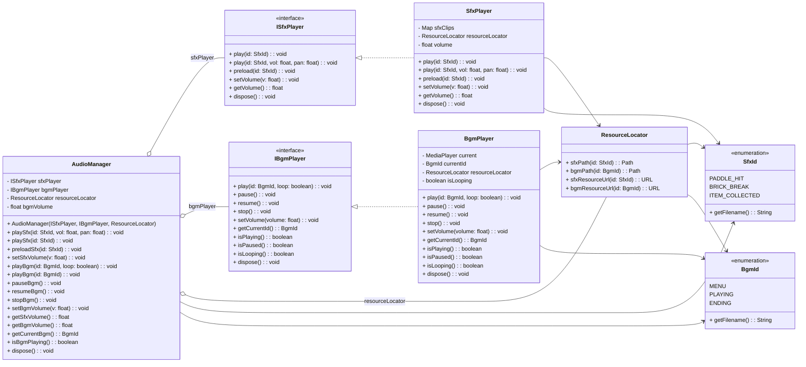

# Audio Package UML Diagram

MermaidJS class diagram for `org.arkanoid.audio`.

```mermaid
classDiagram
    direction LR

    class AudioManager {
      - ISfxPlayer sfxPlayer
      - IBgmPlayer bgmPlayer
      - ResourceLocator resourceLocator
      - float bgmVolume
      + AudioManager(ISfxPlayer, IBgmPlayer, ResourceLocator)
      + playSfx(id: SfxId, vol: float, pan: float): void
      + playSfx(id: SfxId): void
      + preloadSfx(id: SfxId): void
      + setSfxVolume(v: float): void
      + playBgm(id: BgmId, loop: boolean): void
      + playBgm(id: BgmId): void
      + pauseBgm(): void
      + resumeBgm(): void
      + stopBgm(): void
      + setBgmVolume(v: float): void
      + getSfxVolume(): float
      + getBgmVolume(): float
      + getCurrentBgm(): BgmId
      + isBgmPlaying(): boolean
      + dispose(): void
    }

    class IBgmPlayer {
      <<interface>>
      + play(id: BgmId, loop: boolean): void
      + pause(): void
      + resume(): void
      + stop(): void
      + setVolume(volume: float): void
      + getCurrentId(): BgmId
      + isPlaying(): boolean
      + isPaused(): boolean
      + isLooping(): boolean
      + dispose(): void
    }

    class ISfxPlayer {
      <<interface>>
      + play(id: SfxId): void
      + play(id: SfxId, vol: float, pan: float): void
      + preload(id: SfxId): void
      + setVolume(v: float): void
      + getVolume(): float
      + dispose(): void
    }

    class BgmPlayer {
      - MediaPlayer current
      - BgmId currentId
      - ResourceLocator resourceLocator
      - boolean isLooping
      + play(id: BgmId, loop: boolean): void
      + pause(): void
      + resume(): void
      + stop(): void
      + setVolume(volume: float): void
      + getCurrentId(): BgmId
      + isPlaying(): boolean
      + isPaused(): boolean
      + isLooping(): boolean
      + dispose(): void
    }

    class SfxPlayer {
      - Map<SfxId, AudioClip> sfxClips
      - ResourceLocator resourceLocator
      - float volume
      + play(id: SfxId): void
      + play(id: SfxId, vol: float, pan: float): void
      + preload(id: SfxId): void
      + setVolume(v: float): void
      + getVolume(): float
      + dispose(): void
    }

    class ResourceLocator {
      + sfxPath(id: SfxId): Path
      + bgmPath(id: BgmId): Path
      + sfxResourceUrl(id: SfxId): URL
      + bgmResourceUrl(id: BgmId): URL
    }

    class SfxId {
      <<enumeration>>
      PADDLE_HIT
      BRICK_BREAK
      ITEM_COLLECTED
      + getFilename(): String
    }

    class BgmId {
      <<enumeration>>
      MENU
      PLAYING
      ENDING
      + getFilename(): String
    }

    IBgmPlayer <|.. BgmPlayer
    ISfxPlayer <|.. SfxPlayer

    AudioManager o-- ISfxPlayer : sfxPlayer
    AudioManager o-- IBgmPlayer : bgmPlayer
    AudioManager o-- ResourceLocator : resourceLocator

    BgmPlayer --> ResourceLocator
    BgmPlayer --> BgmId
    SfxPlayer --> ResourceLocator
    SfxPlayer --> SfxId
    ResourceLocator --> SfxId
    ResourceLocator --> BgmId
    AudioManager --> SfxId
    AudioManager --> BgmId
```
