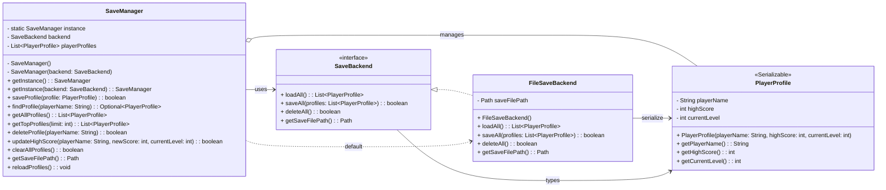

# IO Package UML Diagram

MermaidJS class diagram for `org.arkanoid.io`.

```mermaid
classDiagram
    direction LR

    class PlayerProfile {
      <<Serializable>>
      - String playerName
      - int highScore
      - int currentLevel
      + PlayerProfile(playerName: String, highScore: int, currentLevel: int)
      + getPlayerName(): String
      + getHighScore(): int
      + getCurrentLevel(): int
    }

    class SaveBackend {
      <<interface>>
      + loadAll(): List~PlayerProfile~
      + saveAll(profiles: List~PlayerProfile~): boolean
      + deleteAll(): boolean
      + getSaveFilePath(): Path
    }

    class FileSaveBackend {
      - Path saveFilePath
      + FileSaveBackend()
      + loadAll(): List~PlayerProfile~
      + saveAll(profiles: List~PlayerProfile~): boolean
      + deleteAll(): boolean
      + getSaveFilePath(): Path
    }

    class SaveManager {
      - static SaveManager instance
      - SaveBackend backend
      - List~PlayerProfile~ playerProfiles
      - SaveManager()
      - SaveManager(backend: SaveBackend)
      + getInstance(): SaveManager
      + getInstance(backend: SaveBackend): SaveManager
      + saveProfile(profile: PlayerProfile): boolean
      + findProfile(playerName: String): Optional~PlayerProfile~
      + getAllProfiles(): List~PlayerProfile~
      + getTopProfiles(limit: int): List~PlayerProfile~
      + deleteProfile(playerName: String): boolean
      + updateHighScore(playerName: String, newScore: int, currentLevel: int): boolean
      + clearAllProfiles(): boolean
      + getSaveFilePath(): Path
      + reloadProfiles(): void
    }

    SaveBackend <|.. FileSaveBackend

    SaveManager o-- PlayerProfile : manages
    SaveManager --> SaveBackend : uses
    SaveManager ..> FileSaveBackend : default

    FileSaveBackend --> PlayerProfile : serialize
    SaveBackend --> PlayerProfile : types
```
